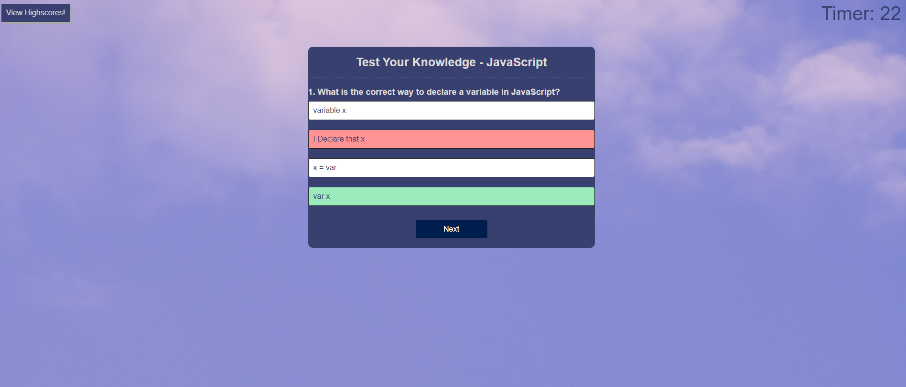

# Module4_QuizChallenge

Welcome to my introductory JavaScript quiz! This quiz is comprehensive demonstration of the CSS, HTML, and JavaScript skills I have obtained during the bootcamp so far. 

Check out the many features the quiz offers and have fun!


# Features
```
GIVEN you are taking a code quiz.

WHEN you click the start button, THEN a timer starts and you are presented with a question.

WHEN you answer a question, THEN you are presented with another question.

WHEN you answer a question incorrectly, THEN time is subtracted from the clock.

WHEN all questions are answered or the timer reaches 0, THEN the game is over.

WHEN the game is over, THEN you can save your initials and your score.

```

# Additional Features
```
When you hover over an option, the color changes.

When you choose an answer, the correct answer is revealed. All other choices become un-clickable.

When you complete the game, you are presented with your score. 

You are then granted the choice to submit your score OR play again. 

```

# Website
Link to the website can be found here via URL: 
https://waltscode.github.io/Module4_QuizChallenge/ 


# Screenshot
A Screenshot of the website can be found here

